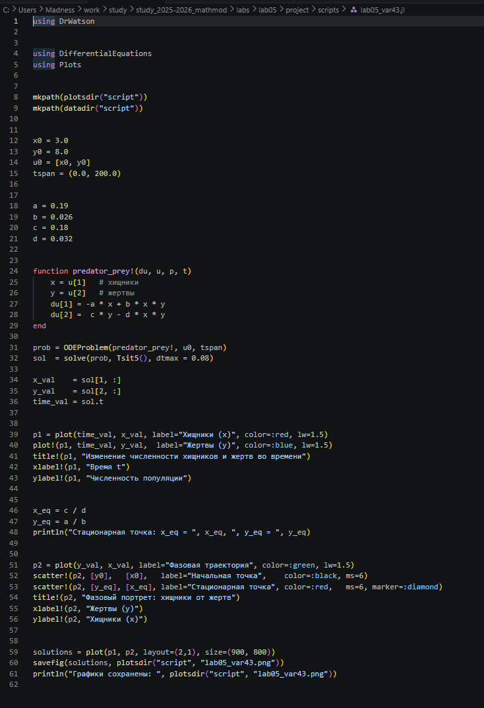
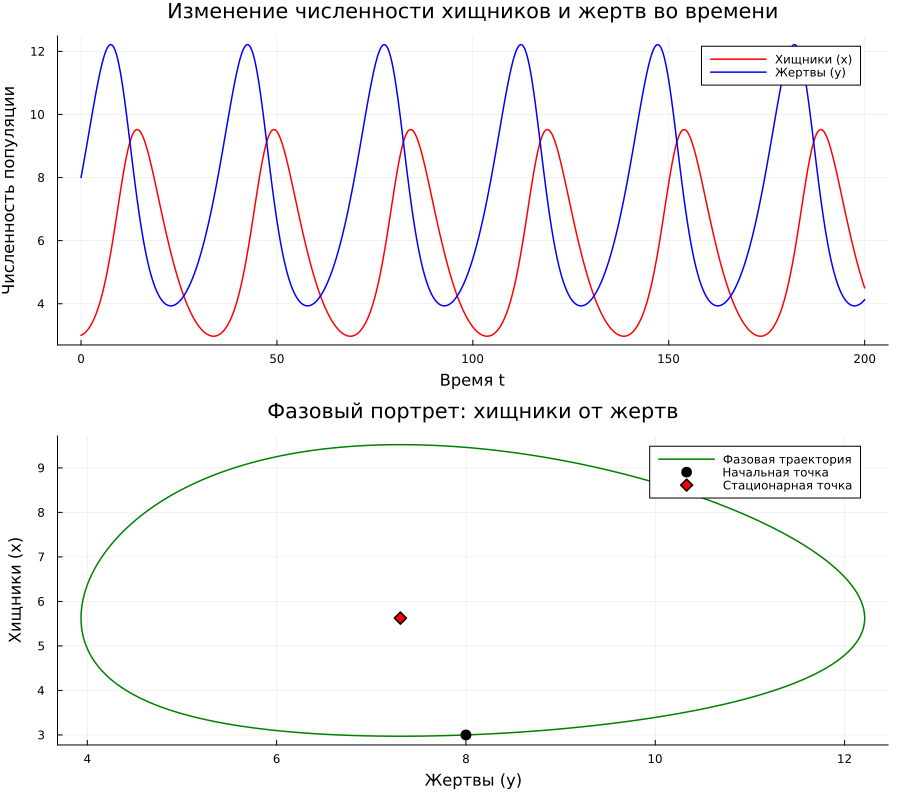

---
## Author
author:
  name: Митрофанов Тимур Александрович
  email: 1132231842@rudn.ru
  affiliation:
      name: Российский университет дружбы народов
      country: Российская Федерация
      postal-code: 117198
      city: Москва
      address: ул. Миклухо-Маклая, д. 6

## Title
title: "Лабораторная работа 5"
subtitle: "Модель хищник-жертва"
license: "CC BY"
---

# Цель работы

Целью лабораторной работы является построение простейшей модели взаимодействия двух видов типа «хищник — жертва» — модели Лотки-Вольтерры.

# Выполнение лабораторной работы

Выполняется вариант №43.

## Математическая модель

В данной лабораторной работе рассматривается простейшая математическая модель взаимодействия двух видов типа «хищник — жертва» — модель Лотки-Вольтерры.

Пусть $x(t)$ — численность популяции хищников, а $y(t)$ — численность популяции жертв в момент времени $t$.

Динамика изменения численности популяций описывается следующей системой обыкновенных дифференциальных уравнений:

$$
\begin{cases}
\dfrac{dx}{dt} = -0.19\,x(t) + 0.026\,x(t)y(t) \\
\dfrac{dy}{dt} = 0.18\,y(t) - 0.032\,x(t)y(t)
\end{cases}
$$

где

- $a = 0.19$ — коэффициент смертности хищников;
- $b = 0.026$ — коэффициент прироста хищников за счёт поедания жертв;
- $c = 0.18$ — коэффициент естественного прироста жертв;
- $d = 0.032$ — коэффициент смертности жертв от хищников.

### Биологический смысл уравнений

- $\dfrac{dx}{dt}$ и $\dfrac{dy}{dt}$ — скорости изменения численности хищников и жертв соответственно.
- Слагаемое $-0.19\,x(t)$ описывает естественную убыль популяции хищников в отсутствие пищи.
- Слагаемое $0.18\,y(t)$ описывает естественный прирост популяции жертв в условиях избытка корма.
- Произведение $x(t)y(t)$ пропорционально частоте встреч хищников и жертв.
- Слагаемое $-0.032\,x(t)y(t)$ — убыль жертв за счёт того, что их съедают хищники.
- Слагаемое $+0.026\,x(t)y(t)$ — прирост хищников за счёт поглощённой пищи.

### Стационарное состояние системы

Для нахождения стационарного состояния приравняем правые части уравнений к нулю:

$$
\begin{cases}
-0.19\,x + 0.026\,x y = 0 \\
0.18\,y - 0.032\,x y = 0
\end{cases}
\quad\Longleftrightarrow\quad
\begin{cases}
x(-0.19 + 0.026\,y) = 0 \\
y(0.18 - 0.032\,x) = 0
\end{cases}
$$

Нетривиальное решение:

$$
y_0 = \frac{a}{b} = \frac{0.19}{0.026} \approx 7.3077
$$

$$
x_0 = \frac{c}{d} = \frac{0.18}{0.032} = 5.625
$$

Координаты стационарной точки: $x_{eq} \approx 5.625$, $y_{eq} \approx 7.308$. Если в начальный момент задать численности равными этим значениям, система останется в равновесии. При любом другом начальном условии в системе возникают периодические колебания вокруг стационарной точки.

## Программный код

Программная реализация модели на языке Julia с использованием пакетов DrWatson и DifferentialEquations ([рис. @fig-001]).

```julia
using DrWatson

using DifferentialEquations
using Plots


mkpath(plotsdir("project"))
mkpath(datadir("project"))

# начальные условия
x0 = 3.0
y0 = 8.0
u0 = [x0, y0]
tspan = (0.0, 200.0)

# коэффициенты
a = 0.19
b = 0.026
c = 0.18
d = 0.032

function predator_prey!(du, u, p, t)
    x = u[1]
    y = u[2]
    du[1] = -a * x + b * x * y
    du[2] =  c * y - d * x * y
end

prob = ODEProblem(predator_prey!, u0, tspan)
sol  = solve(prob, Tsit5(), dtmax = 0.08)

x_val    = sol[1, :]
y_val    = sol[2, :]
time_val = sol.t

p1 = plot(time_val, x_val, label="Хищники (x)", color=:red)
plot!(p1, time_val, y_val,  label="Жертвы (y)", color=:blue)
title!(p1, "Изменение численности хищников и жертв во времени")
xlabel!(p1, "Время t")
ylabel!(p1, "Численность популяции")

p2 = plot(y_val, x_val, label="Фазовая траектория", color=:green)
scatter!(p2, [y0], [x0], label="Начальная точка", color=:black)

x_eq = c / d
y_eq = a / b
scatter!(p2, [y_eq], [x_eq], label="Стационарная точка", color=:red)

title!(p2, "Фазовый портрет: хищники от жертв")
xlabel!(p2, "Жертвы (y)")
ylabel!(p2, "Хищники (x)")

solutions = plot(p1, p2, layout=(2,1), size=(900, 800))
savefig(plotsdir("project", "lab05_var43.png"))
```

{#fig-001 width=70%}

Результат работы программы — график колебаний численностей и фазовый портрет ([рис. @fig-002]).

{#fig-002 width=70%}

# Вывод

В результате выполнения лабораторной работы построена простейшая модель взаимодействия двух видов «хищник — жертва» — модель Лотки-Вольтерры для варианта 43. Численно найдено решение системы ОДУ при начальных условиях $x_0 = 3$, $y_0 = 8$ и построены графики изменения численностей во времени и фазовый портрет. Аналитически найдена стационарная точка $x_{eq} = 5.625$, $y_{eq} \approx 7.308$. Полученная фазовая траектория — замкнутая кривая вокруг этой точки, что подтверждает периодический характер колебаний.
